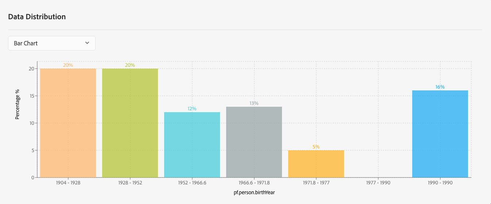

# Access Real-time Customer Profile data using APIs

This document provides a tutorial for accessing Real-time Customer Profile data using Adobe Experience Platform APIs. The tutorial covers steps for the following:

- [List Real-time Customer Profile data fields](#list-real-time-customer-profile-data-fields)
- [Summarize a data field](#summarize-an-xdm-field)
- Access profile data by:
    - [Identity](#access-profile-data-by-identity)
    - [List of identities](#access-profile-data-by-list-of-identities) 
- Access time series events by:
    - [Identity](#access-time-series-events-for-a-profile-by-identity)
    - [List of identities](#access-time-series-events-for-multiple-profiles-by-identities)
- [Access an exported segment](#access-an-exported-segment)
- [Ensure your requests are GDPR-compliant](#ensure-your-requests-are-gdpr-compliant)

## Getting started

This tutorial requires a working understanding of the Experience Platform services involved in managing Real-time Customer Profile data. Before beginning this tutorial, please review the documentation for the following services:

- [Real-time Customer Profile](../../technical_overview/unified_profile_architectural_overview/unified_profile_architectural_overview.md): Provides a unified, real-time consumer profile based on aggregated data from multiple sources.
- [Experience Data Model (XDM)](../../technical_overview/schema_registry/xdm_system/xdm_system_in_experience_platform.md): The standardized framework by which Platform organizes customer experience data.

## Tutorial

You are required to have completed the
[Authentication to Adobe Experience Platform tutorial](../authenticate_to_acp_tutorial/authenticate_to_acp_tutorial.md) in order to successfully make calls to Platform APIs. Completing the authentication tutorial provides the values for each of the required headers in all Experience Platform API calls, as shown below:

* Authorization: Bearer `{ACCESS_TOKEN}`
* x-api-key: `{API_KEY}`
* x-gw-ims-org-id: `{IMS_ORG}`

Additional headers may be required to complete specific requests. The correct headers are shown in each of the examples within this document. Please pay special attention to the sample requests in order to ensure that all required headers are included.

## List Real-time Customer Profile data fields

All Real-time Customer Profile data is stored in data fields that conform to Profile-enabled XDM schemas. The names of these XDM data fields are often required when interacting with Profile APIs, such as when indicating specific data fields to retrieve, or when building segment rules.

Using the [Profile Preview API](../../../../../../acpdr/swagger-specs/profile-preview-api.yaml), you can list all fields for a given schema for which data has been supplied during any ingest.

#### API format

```http
GET /observedschemanonnull
```

#### Request

The following request lists all of the fields used by data ingestion for a specified schema. The schema is specified using the required header, `model-name`. In this case, the schema is `_xdm.context.profile`.

```shell
curl -X GET \
  https://platform.adobe.io/data/core/ups/observedschemanonnull \
  -H 'Authorization: Bearer {ACCESS_TOKEN}' \
  -H 'x-api-key: {API_KEY}' \
  -H 'x-gw-ims-org-id: {IMS_ORG}'
  -H 'model-name: _xdm.context.profile'
```

#### Response

A successful response returns a list of XDM fields. All fields prefixed with "pf" are profile fields (XDM Profile), where those prefixed with "tps" are time series fields (XDM ExperienceEvent).

```json
{
    "nonNullCols": [
        "pf.identities.id",
        "pf.identities.namespace.code",
        "pf.identities.primary",
        "pf.person.name.firstName",
        "pf.person.name.lastName",
        "pf.person.name.courtesyTitle",
        "pf.person.birthYear",
        "pf.homeAddress._schema.latitude",
        "pf.homeAddress._schema.longitude",
        "pf.homeAddress.countryCode",
        "pf.homeAddress.stateProvince",
        "pf.homeAddress.city",
        "pf.homeAddress.postalCode",
        "pf.homeAddress.street1",
        "pf.homeAddress.country",
        "pf.workAddress._schema.latitude",
        "pf.workAddress._schema.longitude",
        "pf.workAddress.countryCode",
        "pf.workAddress.stateProvince",
        "pf.workAddress.city",
        "pf.workAddress.postalCode",
        "pf.workAddress.street1",
        "pf.workAddress.country",
        "pf.personalEmail.address",
        "pf.workEmail.address",
        "pf.homePhone.number",
        "tps._id",
        "tps.timestamp",
        "tps.endUserIDs._experience.mcid.id",
        "tps.endUserIDs._experience.mcid.namespace.code",
        "tps.endUserIDs._experience.aacustomid.id",
        "tps.endUserIDs._experience.aacustomid.namespace.code",
        "tps.endUserIDs._experience.aacustomid.primary",
        "tps.endUserIDs._experience.acid.id",
        "tps.endUserIDs._experience.acid.namespace.code",
        "tps.environment.browserDetails.userAgent",
        "tps.environment.browserDetails.acceptLanguage",
        "tps.environment.browserDetails.cookiesEnabled",
        "tps.environment.browserDetails.javaScriptVersion",
        "tps.environment.browserDetails.javaEnabled",
        "tps.environment.colorDepth",
        "tps.environment.viewportHeight",
        "tps.environment.viewportWidth",
        "tps.placeContext.localTime",
        "tps.placeContext.geo._schema.latitude",
        "tps.placeContext.geo._schema.longitude",
        "tps.placeContext.geo.countryCode",
        "tps.placeContext.geo.stateProvince",
        "tps.placeContext.geo.city",
        "tps.placeContext.geo.postalCode"
    ]
}
```

### Field names in API calls

 When using these field names in API calls, the prefixes must be excluded. For example, in a request to preview all audiences where a home address city has been specified, the XDM field "pf.homeAddress.city" is expressed as "homeAddress.city" when used in the `predicateExpression` field:

```shell
curl -X POST \
  https://platform.adobe.io/data/core/ups/preview \
  -H 'Authorization: Bearer {ACCESS_TOKEN}' \
  -H 'x-api-key: {API_KEY}' \
  -H 'x-gw-ims-org-id: {IMS_ORG}'
  -H 'Content-Type: application/json' \
  -d '{
        "predicateExpression": "homeAddress.city",
        "predicateType": "pql/text",
        "predicateModel": "_xdm.context.profile",
        "graphType": "simple",
        "mergeStrategy": "simple"
    }'
```

## Summarize an XDM field

Real-time Customer Profile provides summaries for data fields that contain continuous values (such as age), or are restricted to a set of possible values (such as "Home State" or "Eye Color"). Using the summary endpoint in the Profile API, you can view distributions for values that occur within your profile store at a minimum of 5%.



>**Note:** Numeric fields are automatically partitioned according to the clustering of values across your profile store for the field being summarized. The distributions are given for those automatically generated partitions.

If the field being summarized has no values that occur more than 5%, a failure response will be returned as these fields do not convey useful information.

Below are some example use cases for the summary endpoint in the [Profile Preview API](../../../../../../acpdr/swagger-specs/profile-preview-api.yaml).

### Longitude example

The following API call retrieves summary data on the distribution of your consumer base by longitude:

#### API format
```http
GET /preview/data/summary/{SCHEMA_FIELD}
```

* `{SCHEMA_FIELD}`: The name of the XDM field you want to summarize. For example, "pf.homeAddress._schema.longitude".

#### Request

```shell
curl -X GET \
  https://platform.adobe.io/data/core/ups/preview/data/summary/pf.homeAddress._schema.longitude \
  -H 'Authorization: Bearer {ACCESS_TOKEN}' \
  -H 'x-api-key: {API_KEY}' \
  -H 'x-gw-ims-org-id: {IMS_ORG}'
```

#### Response
A successful response returns the summary data for the XDM field. The data is split into groups that are are automatically determined by the system, and are listed under the `quantiles` property. From this data, you can infer that your user base is within the boundaries of -157.86 (`"pct0"`) and -52.6912126 (`"pct100"`). The `summaries` array provides more information on each group, including the number of estimated consumers under `cardinality`.

```json
{
    "quantiles": {
        "pct40": -98.76600142249998,
        "pct50": -94.0084823,
        "pct100": -52.6912126,
        "pct10": -118.118266245,
        "pct80": -78.37563784266666,
        "pct0": -157.86,
        "pct70": -82.47644212,
        "pct60": -87.99093141600001,
        "pct30": -99.581649195,
        "pct20": -106.34355807714286,
        "pct90": -73.75254579999998
    },
    "summaries": [
        {
            "percentage": 0.09627375471568593,
            "exclusiveUpperBound": -106.34355807714286,
            "cardinality": 965.9216479850512,
            "inclusiveLowerBound": -118.118266245,
            "hll": "NOT-SUPPORTED-CURRENTLY",
            "value": "-118.118266245:-106.34355807714286"
        }, 
        {
            "percentage": 0.10656123243076433,
            "exclusiveUpperBound": -99.581649195,
            "cardinality": 1069.1366670471361,
            "inclusiveLowerBound": -106.34355807714286,
            "hll": "NOT-SUPPORTED-CURRENTLY",
            "value": "-106.34355807714286:-99.581649195"
        }, 
        {
            "percentage": 0.10114427374702012,
            "exclusiveUpperBound": -78.37563784266666,
            "cardinality": 1014.7879229442261,
            "inclusiveLowerBound": -82.47644212,
            "hll": "NOT-SUPPORTED-CURRENTLY",
            "value": "-82.47644212:-78.37563784266666"
        }, 
        {
            "percentage": 0.1034787975412938,
            "exclusiveUpperBound": -73.75254579999998,
            "cardinality": 1038.2103715366227,
            "inclusiveLowerBound": -78.37563784266666,
            "hll": "NOT-SUPPORTED-CURRENTLY",
            "value": "-78.37563784266666:-73.75254579999998"
        }, 
        {
            "percentage": 0.09902487161178347,
            "exclusiveUpperBound": -98.76600142249998,
            "cardinality": 993.5238057478365,
            "inclusiveLowerBound": -99.581649195,
            "hll": "NOT-SUPPORTED-CURRENTLY",
            "value": "-99.581649195:-98.76600142249998"
        }, 
        {
            "percentage": 0.08931089503860541,
            "exclusiveUpperBound": -87.99093141600001,
            "cardinality": 896.0627657399768,
            "inclusiveLowerBound": -94.0084823,
            "hll": "NOT-SUPPORTED-CURRENTLY",
            "value": "-94.0084823:-87.99093141600001"
        }, 
        {
            "percentage": 0.10901006611982293,
            "exclusiveUpperBound": -94.0084823,
            "cardinality": 1093.7059952047655,
            "inclusiveLowerBound": -98.76600142249998,
            "hll": "NOT-SUPPORTED-CURRENTLY",
            "value": "-98.76600142249998:-94.0084823"
        }, 
        {
            "percentage": 0.10358499159862096,
            "exclusiveUpperBound": -118.118266245,
            "cardinality": 1039.275824308903,
            "inclusiveLowerBound": -157.86,
            "hll": "NOT-SUPPORTED-CURRENTLY",
            "value": "-157.86:-118.118266245"
        }, 
        {
            "percentage": 0.10040217006872898,
            "exclusiveUpperBound": -82.47644212,
            "cardinality": 1007.3423422662145,
            "inclusiveLowerBound": -87.99093141600001,
            "hll": "NOT-SUPPORTED-CURRENTLY",
            "value": "-87.99093141600001:-82.47644212"
        }, 
        {
            "percentage": 0.08741707457716474,
            "exclusiveUpperBound": -52.6912126,
            "cardinality": 877.0619260354822,
            "inclusiveLowerBound": -73.75254579999998,
            "hll": "NOT-SUPPORTED-CURRENTLY",
            "value": "-73.75254579999998:-52.6912126"
        }
    ],
    "id": "{IMS_ORG}-pf.homeAddress._schema.longitude",
    "summaryType": "NUMBER",
    "fieldName": "pf.homeAddress._schema.longitude"
}
```

### Country code example

The following API call retrieves summary data on the distribution of your consumer base by country code:

#### API format
```http
GET /preview/data/summary/{SCHEMA_FIELD}
```

#### Request

```shell
curl -X GET \
  https://platform.adobe.io/data/core/ups/preview/data/summary/pf.homeAddress.countryCode \
  -H 'Authorization: Bearer {ACCESS_TOKEN}' \
  -H 'x-api-key: {API_KEY}' \
  -H 'x-gw-ims-org-id: {IMS_ORG}'
```

#### Response

A successful response returns the summary data for the XDM field. Notice the lack of discernable values in `quantiles`. This is due to the values being non-numeric. 

```json
{
    "quantiles": {
        "pct40": 0.0,
        "pct50": 0.0,
        "pct100": 0.0,
        "pct10": 0.0,
        "pct80": 0.0,
        "pct0": 0.0,
        "pct70": 0.0,
        "pct60": 0.0,
        "pct30": 0.0,
        "pct20": 0.0,
        "pct90": 0.0
    },
    "summaries": [
        {
            "percentage": 0.2637181166795846,
            "exclusiveUpperBound": 0.0,
            "cardinality": 2646.717948309003,
            "inclusiveLowerBound": 0.0,
            "hll": "NOT-SUPPORTED-CURRENTLY",
            "value": "CA"
        }, 
        {
            "percentage": 0.48713712210991167,
            "exclusiveUpperBound": 0.0,
            "cardinality": 4888.987456035888,
            "inclusiveLowerBound": 0.0,
            "hll": "NOT-SUPPORTED-CURRENTLY",
            "value": "US"
        }, 
        {
            "percentage": 0.24914476121050375,
            "exclusiveUpperBound": 0.0,
            "cardinality": 2500.4573804998995,
            "inclusiveLowerBound": 0.0,
            "hll": "NOT-SUPPORTED-CURRENTLY",
            "value": "MX"
        }
    ],
    "id": "{IMS_ORG}-pf.homeAddress.countryCode",
    "summaryType": "STRING",
    "fieldName": "pf.homeAddress.countryCode"
}
```

## Access Profile data by identity

Using the [Profile Access API](../../../../../../acpdr/swagger-specs/profile-access.yaml), you can access an entity by an identity, which consists of an ID value (`entityId`) and the identity namespace (`entityIdNS`).

#### API format

```http
GET /access?{REQUEST_PARAMETERS}
```

* `{REQUEST_PARAMETERS}`: Parameters included in the request path to specify the data to access, separated by ampersands (`&`). A complete list of valid parameters is provided below.

**Request parameters**

The following parameters are used in the request path. They serve to identify the profile entity you want to access, and filter the data returned in the response. Required parameters are labeled, while the rest are optional.

|Parameter|Description|Example|
|---|---|---|
|`schema.name`</br>**(REQUIRED)**|The XDM schema of the entity to retrieve|_xdm.context.profile|
|`relatedSchema.name`|If `schema.name` is "_xdm.context.experienceevent", this value must specify the schema for the profile entity that the time series events are related to.|_xdm.context.profile|
|`entityId`</br>**(REQUIRED)**|The ID of the entity. If the value of this parameter is not an XID, an identity namespace parameter must also be provided (see `entityIdNS` below).|5558525235|
|`entityIdNS`|If `entityId` is not provided as an XID, this field must specify the identity namespace.|phone|
|`relatedEntityId`|If `schema.name` is "_xdm.context.experienceevent", this value must specify the related profile entity's identity namespace. This value follows the same rules as `entityId`.|69935279872410346619186588147492736556|
|`relatedEntityIdNS`|If `schema.name` is "_xdm.context.experienceevent", this value must specify the identity namespace for the entity specified in `relatedEntityId`. |CRMID|
|`fields`|Filters the data returned in the API response. Use this field to specify which schema field values to include in data retrieved.|personalEmail,person.name,person.gender|
|`mergePolicyId`|Identifies the Merge Policy by which to govern the data returned. If one is not specified in the service call, your organization's default for that schema will be used. If no default Merge Policy has been configured, the default is no profile merge and no identity stitching.|5aa6885fcf70a301dabdfa4a|
|`startTime`|Specifies the start time to filter time series events (in milliseconds).|1539838505|
|`endTime`|Specifies the end time to filter time series events (in milliseconds).|1539838510|
|`limit`|Specifies the maximum number of objects to return. <br>(*Default: 1000*)|100|

#### Request

The following request retrieves a customer's email and name using an identity:

```shell
curl -X GET \
  'https://platform.adobe.io/data/core/ups/access/entities?schema.name=_xdm.context.profile&entityId=janedoe@example.com&entityIdNS=email&fields=identities,person.name,workEmail' \
  -H 'Authorization: Bearer {ACCESS_TOKEN}' \
  -H 'x-api-key: {API_KEY}' \
  -H 'x-gw-ims-org-id: {IMS_ORG}'
```

#### Response

```json
{
    "BVrqzwVv7o2p3naHvnsWpqZXv3KJgA": {
        "entityId": "BVrqzwVv7o2p3naHvnsWpqZXv3KJgA",
        "sources": [
            "1000000000"
        ],
        "entity": {
            "identities": [
                {
                    "id": "89149270342662559642753730269986316601",
                    "namespace": {
                        "code": "ecid"
                    }
                },
                {
                    "id": "janedoe@example.com",
                    "namespace": {
                        "code": "email"
                    }
                },
                {
                    "id": "janesmith@example.com",
                    "namespace": {
                        "code": "email"
                    }
                },
                {
                    "id": "89149270342662559642753730269986316604",
                    "namespace": {
                        "code": "ecid"
                    }
                },
                {
                    "id": "58832431024964181144308914570411162539",
                    "namespace": {
                        "code": "ecid"
                    }
                },
                {
                    "id": "89149270342662559642753730269986316602",
                    "namespace": {
                        "code": "ecid"
                    },
                    "primary": true
                }
            ],
            "person": {
                "name": {
                    "firstName": "Jane",
                    "middleName": "F",
                    "lastName": "Doe"
                }
            },
            "workEmail": {
                "primary": true,
                "address": "janedoe@example.com",
                "label": "Jane Doe",
                "type": "work",
                "status": "active"
            }
        },
        "lastModifiedAt": "2018-08-28T20:57:24Z"
    }
}
```

> **Note:** If a related graph links more than 50 identities, this service will return an HTTP status code of 422 and the message "Too many related identities". If you receive this error, consider adding more request parameters to narrow down your search.

## Access profile data by list of identities

You can use the [Profile Access API](../../../../../../acpdr/swagger-specs/profile-access.yaml) to access multiple profile entities by their identities. These identities consist of an ID value (`entityId`) and an identity namespace (`entityIdNS`).

#### API format

```http
POST /entities
```

#### Request

The following request retrieves the names and email addresses of several customers by a list of identities:

```shell
curl -X POST \
  https://platform.adobe.io/data/core/ups/access/entities \
  -H 'Content-Type: application/json' \
  -H 'Authorization: Bearer {ACCESS_TOKEN}' \
  -H 'x-api-key: {API_KEY}' \
  -H 'x-gw-ims-org-id: {IMS_ORG}' \
  -d '{
    "schema":{
        "name":"_xdm.context.profile"
    },
    "fields":["identities","person.name","workEmail"],
    "identities":[
        {
            "entityId":"89149270342662559642753730269986316601",
            "entityIdNS":{
                "code":"ECID"
            }
        },
        {
            "entityId":"89149270342662559642753730269986316900",
            "entityIdNS":{
                "code":"ECID"
            }
        },
        {
            "entityId":"89149270342662559642753730269986316602",
            "entityIdNS":{
                "code":"ECID"
            }
        }
    ]
}'
```

* `schema > name`: The name of the XDM schema the entity belongs to.
* `fields`: The XDM data fields you want the response to return, as an array of strings.
* `identities`: The list of identities for the entities you want to access, in the form of an array.
* `identities > entityId`: The ID of a listed entity
* `identities > entityIdNS > code`: The namespace of an entity's ID 

#### Response
A successful response returns the requested fields of entities specified in the request body.

```json
{
    "A29cgveD5y64ezlhxjUXNzcm": {
        "entityId": "A29cgveD5y64ezlhxjUXNzcm",
        "sources": [
            "1000000000"
        ],
        "entity": {
            "identities": [
                {
                    "id": "89149270342662559642753730269986316601",
                    "namespace": {
                        "code": "ecid"
                    }
                },
                {
                    "id": "janedoe@example.com",
                    "namespace": {
                        "code": "email"
                    }
                },
                {
                    "id": "05DD23564EC4607F0A490D44",
                    "namespace": {
                        "code": "ecid"
                    }
                },
                {
                    "id": "89149270342662559642753730269986316603",
                    "namespace": {
                        "code": "ecid"
                    }
                },
                {
                    "id": "janesmith@example.com",
                    "namespace": {
                        "code": "email"
                    }
                },
                {
                    "id": "89149270342662559642753730269986316604",
                    "namespace": {
                        "code": "ecid"
                    }
                },
                {
                    "id": "89149270342662559642753730269986316700",
                    "namespace": {
                        "code": "ecid"
                    }
                },
                {
                    "id": "89149270342662559642753730269986316701",
                    "namespace": {
                        "code": "ecid"
                    }
                },
                {
                    "id": "58832431024964181144308914570411162539",
                    "namespace": {
                        "code": "ecid"
                    }
                },
                {
                    "id": "89149270342662559642753730269986316602",
                    "namespace": {
                        "code": "ecid"
                    },
                    "primary": true
                }
            ],
            "person": {
                "name": {
                    "firstName": "Jane",
                    "middleName": "F",
                    "lastName": "Doe"
                }
            },
            "workEmail": {
                "primary": true,
                "address": "janedoe@example.com",
                "label": "Jane Doe",
                "type": "work",
                "status": "active"
            }
        },
        "lastModifiedAt": "2018-08-28T20:57:24Z"
    },
    "A29cgveD5y64e2RixjUXNzcm": {
        "entityId": "A29cgveD5y64e2RixjUXNzcm",
        "sources": [
            ""
        ],
        "entity": {},
        "lastModifiedAt": "1970-01-01T00:00:00Z"
    },
    "A29cgveD5y64ezphxjUXNzcm": {
        "entityId": "A29cgveD5y64ezphxjUXNzcm",
        "sources": [
            "1000000000"
        ],
        "entity": {
            "identities": [
                {
                    "id": "89149270342662559642753730269986316602",
                    "namespace": {
                        "code": "ecid"
                    },
                    "primary": true
                },
                {
                    "id": "janedoe@example.com",
                    "namespace": {
                        "code": "email"
                    }
                }
            ],
            "person": {
                "name": {
                    "firstName": "Jane",
                    "middleName": "F",
                    "lastName": "Doe"
                }
            },
            "workEmail": {
                "primary": true,
                "address": "janedoe@example.com",
                "label": "Jane Doe",
                "type": "work",
                "status": "active"
            }
        },
        "lastModifiedAt": "2018-08-27T23:25:52Z"
    }
}
```

## Access time series events for a profile by identity

You can use the [Profile Access API](../../../../../../acpdr/swagger-specs/profile-access.yaml) to access time series events by the identity of their associated profile entity. This identity consists of an ID value (`entityId`) and an identity namespace (`entityIdNS`).


#### API format

```http
GET /entities?{REQUEST_PARAMETERS}
```
* `{REQUEST_PARAMETERS}`: Parameters included in the request path to specify the data to access. Examples are listed below.

**Request parameters**

The following parameters are used in the request path. They serve to identify the profile entity whose time series events you wish to access, and filter the data returned in the response. Required parameters are labeled, while the rest are optional.

|Parameter|Description|Example|
|---|---|---|
|`schema.name`</br>**(REQUIRED)**|The XDM schema of the entity to retrieve|_xdm.context.experienceevent|
|`relatedSchema.name`|If `schema.name` is "_xdm.context.experienceevent", this value must specify the schema for the profile entity that the time series events are related to.|_xdm.context.profile|
|`entityId`</br>**(REQUIRED)**|The ID of the entity. If the value of this parameter is not an XID, an identity namespace parameter must also be provided (see `entityIdNS` below).|5558525235|
|`entityIdNS`|If `entityId` is not provided as an XID, this field must specify the identity namespace.|phone|
|`relatedEntityId`|If `schema.name` is "_xdm.context.experienceevent", this value must specify the related profile entity's identity namespace. This value follows the same rules as `entityId`.|69935279872410346619186588147492736556|
|`relatedEntityIdNS`|If `schema.name` is "_xdm.context.experienceevent", this value must specify the identity namespace for the entity specified in `relatedEntityId`. |CRMID|
|`fields`|Filters the data returned in the API response. Use this field to specify which schema field values to include in data retrieved.|personalEmail,person.name,person.gender|
|`mergePolicyId`|Identifies the Merge Policy by which to govern the data returned. If one is not specified in the service call, your organization's default for that schema will be used. If no default Merge Policy has been configured, the default is no profile merge and no identity stitching.|5aa6885fcf70a301dabdfa4a|
|`orderBy`|Specifies the field by which to order results. For example, `orderBy=timestamp` or `orderBy=+timestamp` to sort by timestamp in ascending order, or `orderBy=-timestamp`, to sort in descending order. Omitting this value results in the default sorting of `timestamp` in ascending order.|
|`timeFilter.startTime`|Specify the start time to filter time-series objects (in milliseconds).|1539838505|
|`timeFilter.endTime`|Specify the end time to filter time-series objects (in milliseconds).|1539838510|
|`limit`|Numeric value specifying the maximum number of objects to return. <br>**Default: 1000**|100|

#### Request

The following request finds a profile entity by ID, and retrieves the values for the properties `endUserIDs`, `web`, and `channel` for all time series events associated with the entity. 

```shell
curl -X GET \
  'https://platform.adobe.io/data/core/ups/access/entities?schema.name=_xdm.context.experienceevent&relatedSchema.name=_xdm.context.profile&relatedEntityId=89149270342662559642753730269986316900&relatedEntityIdNS=ECID&fields=endUserIDs,web,channel&startTime=1531260476000&endTime=1531260480000&limit=1' \
  -H 'Authorization: Bearer {ACCESS_TOKEN}' \
  -H 'x-api-key: {API_KEY}' \
  -H 'x-gw-ims-org-id: {IMS_ORG}'
```

#### Response

A successful response returns a paginated list of time series events and associated fields that were specified in the request parameters. 

```json
{
    "_page": {
        "orderby": "timestamp",
        "start": "c8d11988-6b56-4571-a123-b6ce74236036",
        "count": 1,
        "next": "c8d11988-6b56-4571-a123-b6ce74236037"
    },
    "children": [
        {
            "relatedEntityId": "A29cgveD5y64e2RixjUXNzcm",
            "entityId": "c8d11988-6b56-4571-a123-b6ce74236036",
            "timestamp": 1531260476000,
            "entity": {
                "endUserIDs": {
                    "_experience": {
                        "ecid": {
                            "id": "89149270342662559642753730269986316900",
                            "namespace": {
                                "code": "ecid"
                            }
                        }
                    }
                },
                "channel": {
                    "_type": "web"
                },
                "web": {
                    "webPageDetails": {
                        "name": "Fernie Snow",
                        "pageViews": {
                            "value": 1
                        }
                    }
                }
            },
            "lastModifiedAt": "2018-08-21T06:49:02Z"
        }
    ],
    "_links": {
        "next": {
            "href": "/entities?start=c8d11988-6b56-4571-a123-b6ce74236037&orderby=timestamp&schema.name=_xdm.context.experienceevent&relatedSchema.name=_xdm.context.profile&relatedEntityId=89149270342662559642753730269986316900&relatedEntityIdNS=ECID&fields=endUserIDs,web,channel&startTime=1531260476000&endTime=1531260480000&limit=1"
        }
    }
}
```

### Access a subsequent page of results

Results are paginated when retrieving time series events. If there are subsequent pages of results, the response's `_page.next` parameter will contain an ID. Additionally, the response's `_links.next.href` parameter provides a request URI for retrieving the subsequent page. 

#### API Format

```http
GET /access/{NEXT_URI}
```
* `{NEXT_URI}`: The URI value taken from the `_links.next.href` parameter in the previous response.

#### Request

The following request retrieves the next page of results by using the `_links.next.href` URI as the request path.

```shell
curl -X GET \
  'https://platform.adobe.io/data/core/ups/access/entities?start=c8d11988-6b56-4571-a123-b6ce74236037&orderby=timestamp&schema.name=_xdm.context.experienceevent&relatedSchema.name=_xdm.context.profile&relatedEntityId=89149270342662559642753730269986316900&relatedEntityIdNS=ECID&fields=endUserIDs,web,channel&startTime=1531260476000&endTime=1531260480000&limit=1' \
  -H 'Authorization: Bearer {ACCESS_TOKEN}' \
  -H 'x-api-key: {API_KEY}' \
  -H 'x-gw-ims-org-id: {IMS_ORG}'
```

#### Response

A successful response returns the next page of results. This example demonstrates a response where there are no subsequent pages of results, as indicated by the empty string values of `_page.next` and `_links.next.href`.

```json
{
    "_page": {
        "orderby": "timestamp",
        "start": "c8d11988-6b56-4571-a123-b6ce74236037",
        "count": 1,
        "next": ""
    },
    "children": [
        {
            "relatedEntityId": "A29cgveD5y64e2RixjUXNzcm",
            "entityId": "c8d11988-6b56-4571-a123-b6ce74236037",
            "timestamp": 1531260477000,
            "entity": {
                "endUserIDs": {
                    "_experience": {
                        "ecid": {
                            "id": "89149270342662559642753730269986316900",
                            "namespace": {
                                "code": "ecid"
                            }
                        }
                    }
                },
                "channel": {
                    "_type": "web"
                },
                "web": {
                    "webPageDetails": {
                        "name": "Fernie Snow",
                        "pageViews": {
                            "value": 1
                        }
                    }
                }
            },
            "lastModifiedAt": "2018-08-21T06:50:01Z"
        }
    ],
    "_links": {
        "next": {
            "href": ""
        }
    }
}
```

## Access time series events for multiple profiles by identities

Using the [Profile Access API](../../../../../../acpdr/swagger-specs/profile-access.yaml), you can access time series events by a collection of identities from multiple associated profiles, where an identity consists of an ID value (`entityId`) and the identity namespace (`entityIdNS`).

#### API format

Unlike previous examples, this API call does not use any request parameters. All parameters are supplied in the request payload instead.

```http
GET /entities
```

**Payload parameters**

The following is a list of accepted parameters for the request payload. Unlike previous examples, these parameters are used in the request body, not the path. They serve to identify the profile entities whose time series events you wish to access, and filter the data returned in the response. Required parameters are labeled, while the rest are optional.

|Parameter|Description|Example|
|---|---|---|
|`schema.name`</br>**(REQUIRED)**|The XDM schema of the entity to retrieve|_xdm.context.profile|
|`relatedSchema.name`|If `schema.name` is "_xdm.context.experienceevent", this value must specify the schema for the profile entity that the time series events are related to.|_xdm.context.profile|
|`identities`</br>**(REQUIRED)**|List of profiles to retrieve associated time series events from. Each entry of this can be set one of two ways; using a fully qualified identity consisting of ID value and namespace, or providing an XID.|`[ { "relatedEntityId": "GkouAW-yD9aoRCPhRYROJ-TetAFW" } ]`|
|`fields`|Isolates the data returned to a specified set of fields. Use this field to filter which schema field values are included in data retrieved.|personalEmail,person.name,person.gender|
|`mergePolicyId`|Identifies the Merge Policy by which to govern the data returned. If one is not specified in the service call, your organization's default for that schema will be used. If not default Merge Policy has been configured, the default is no profile merge and no identity stitching.|5aa6885fcf70a301dabdfa4a|
|`orderBy`|Specify the field by which to order results. For example, `orderBy=name` or `orderBy=+name` sorts by name in ascending order, and `orderBy=-name` sorts in descending order. Omitting this value results in the default sorting of `name` in ascending order.|
|`timeFilter.startTime`|Specify the start time to filter time-series objects (in milliseconds).|1539838505|
|`timeFilter.endTime`|Specify the end time to filter time-series objects (in milliseconds).|1539838510|
|`limit`|Numeric value specifying the maximum number of objects to return. <br>(*Default: 1000*)|100|

#### Request

The following request retrieves user IDs, local times, and country codes for time series events associated with a list of profile identities:

```shell
curl -X POST \
  https://platform.adobe.io/data/core/ups/access/entities \
  -H 'Content-Type: application/json' \
  -H 'Authorization: Bearer {ACCESS_TOKEN}' \
  -H 'x-api-key: {API_KEY}' \
  -H 'x-gw-ims-org-id: {IMS_ORG}' \
  -d '{
    "schema": {
        "name": "_xdm.context.experienceevent"
    },
    "relatedSchema": {
        "name": "_xdm.context.profile"
    },
    "timeFilter": {
        "startTime": 1537275882000
    },
    "fields": [
        "endUserIDs",
        "placeContext.localTime",
        "placeContext.geo.countryCode"
    ],
    "identities": [
        {"relatedEntityId": "GkouAW-yD9aoRCPhRYROJ-TetAFW"}
        {"relatedEntityId": "GkouAW-2u-7iWt5vQ9u2wm40JOZY"}
    ],
    "limit": 10
}'
```

#### Response

A successful response returns a paginated list of time series events associated with the multiple profiles specified in the request. In the example response below, notice the first listed profile ("GkouAW-yD9aoRCPhRYROJ-TetAFW") provides a value for `_links.next.payload`. Using this payload in the request body of another API call to the same endpoint will retrieve the subsequent page of time series data for that profile. See the next section on [accessing subsequent pages](#access-a-subsequent-page-of-results-1) for more details.

```json
{
    "GkouAW-yD9aoRCPhRYROJ-TetAFW": {
        "_page": {
            "orderby": "timestamp",
            "start": "ee0fa8eb-f09c-4d72-a432-fea7f189cfcd",
            "count": 10,
            "next": "40cb2fb3-78cd-49d3-806f-9bdb22748226"
        },
        "children": [
            {
                "relatedEntityId": "GkouAW-yD9aoRCPhRYROJ-TetAFW",
                "entityId": "ee0fa8eb-f09c-4d72-a432-fea7f189cfcd",
                "timestamp": 1537275882000,
                "entity": {
                    "endUserIDs": {
                        "_experience": {
                            "mcid": {
                                "id": "67971860962043911970658021809222795905",
                                "namespace": {
                                    "code": "ECID"
                                }
                            },
                            "aacustomid": {
                                "id": "50353446361742744826197433431642033796",
                                "namespace": {
                                    "code": "CRMID"
                                },
                                "primary": true
                            },
                            "acid": {
                                "id": "2de32e9a00003314-2fd9c00000000026",
                                "namespace": {
                                    "code": "AVID"
                                }
                            }
                        }
                    },
                    "placeContext": {
                        "localTime": "2018-09-18T13:04:42Z",
                        "geo": {
                            "countryCode": "MX"
                        }
                    }
                },
                "lastModifiedAt": "2018-10-24T17:35:01Z"
            },
            {
                "relatedEntityId": "GkouAW-yD9aoRCPhRYROJ-TetAFW",
                "entityId": "a9e137b4-1348-4878-8167-e308af523d8b",
                "timestamp": 1537275889000,
                "entity": {
                    "endUserIDs": {
                        "_experience": {
                            "mcid": {
                                "id": "67971860962043911970658021809222795905",
                                "namespace": {
                                    "code": "ECID"
                                }
                            },
                            "aacustomid": {
                                "id": "50353446361742744826197433431642033796",
                                "namespace": {
                                    "code": "CRMID"
                                },
                                "primary": true
                            },
                            "acid": {
                                "id": "2de32e9a00003314-2fd9c00000000026",
                                "namespace": {
                                    "code": "AVID"
                                }
                            }
                        }
                    },
                    "placeContext": {
                        "localTime": "2018-09-18T13:04:49Z",
                        "geo": {
                            "countryCode": "MX"
                        }
                    }
                },
                "lastModifiedAt": "2018-10-24T17:35:01Z"
            }
        ],
        "_links": {
            "next": {
                "href": "/entities",
                "payload": {
                    "schema": {
                        "name": "_xdm.context.experienceevent"
                    },
                    "relatedSchema": {
                        "name": "_xdm.context.profile"
                    },
                    "timeFilter": {
                        "startTime": 1537275882000
                    },
                    "fields": [
                        "endUserIDs",
                        "placeContext.localTime",
                        "placeContext.geo.countryCode"
                    ],
                    "identities": [
                        {
                            "relatedEntityId": "GkouAW-yD9aoRCPhRYROJ-TetAFW",
                            "start": "40cb2fb3-78cd-49d3-806f-9bdb22748226"
                        }
                    ],
                    "limit": 10
                }
            }
        }
    },
    "GkouAW-2u-7iWt5vQ9u2wm40JOZY": {
        "_page": {
            "orderby": "timestamp",
            "start": "2746d0db-fa64-4e29-b67e-324bec638816",
            "count": 9,
            "next": ""
        },
        "children": [
            {
                "relatedEntityId": "GkouAW-2u-7iWt5vQ9u2wm40JOZY",
                "entityId": "2746d0db-fa64-4e29-b67e-324bec638816",
                "timestamp": 1537559483000,
                "entity": {
                    "endUserIDs": {
                        "_experience": {
                            "mcid": {
                                "id": "76436745599328540420034822220063618863",
                                "namespace": {
                                    "code": "ECID"
                                }
                            },
                            "aacustomid": {
                                "id": "48593470048917738786405847327596263131",
                                "namespace": {
                                    "code": "CRMID"
                                },
                                "primary": true
                            },
                            "acid": {
                                "id": "2de32e9a80007451-03da600000000028",
                                "namespace": {
                                    "code": "AVID"
                                }
                            }
                        }
                    },
                    "placeContext": {
                        "localTime": "2018-09-21T19:51:23Z",
                        "geo": {
                            "countryCode": "US"
                        }
                    }
                },
                "lastModifiedAt": "2018-10-24T17:34:58Z"
            },
            {
                "relatedEntityId": "GkouAW-2u-7iWt5vQ9u2wm40JOZY",
                "entityId": "9bf337a1-3256-431e-a38c-5c0d42d121d1",
                "timestamp": 1537559486000,
                "entity": {
                    "endUserIDs": {
                        "_experience": {
                            "mcid": {
                                "id": "76436745599328540420034822220063618863",
                                "namespace": {
                                    "code": "ECID"
                                }
                            },
                            "aacustomid": {
                                "id": "48593470048917738786405847327596263131",
                                "namespace": {
                                    "code": "CRMID"
                                },
                                "primary": true
                            },
                            "acid": {
                                "id": "2de32e9a80007451-03da600000000028",
                                "namespace": {
                                    "code": "AVID"
                                }
                            }
                        }
                    },
                    "placeContext": {
                        "localTime": "2018-09-21T19:51:26Z",
                        "geo": {
                            "countryCode": "US"
                        }
                    }
                },
                "lastModifiedAt": "2018-10-24T17:34:58Z"
            }
        ],
        "_links": {
            "next": {
                "href": ""
            }
        }
    }
}`
```

### Access a subsequent page of results

Results are paginated when retrieving time series events. If there are subsequent pages of results for a particular profile, the response's `_links.next.payload` parameter for that profile will contain a payload object. Using this object as the payload for another API call to the same endpoint will retrieve the subsequent page of time series data for that profile.

## Access an exported segment

You can access Profile data using criteria (or rules) by using the Segmentation Service. The [Profile Segment Definition API](../../../../../../acpdr/swagger-specs/profile-segment-definitions-api.yaml) creates segment definitions, which are tested using the [Profile Preview API](../../../../../../acpdr/swagger-specs/profile-preview-api.yaml). These segments are then applied against your profile store using the [Profile Segment Jobs API](../../../../../../acpdr/swagger-specs/profile-segment-jobs-api.yaml). For more details on creating segments, see the [create a segment tutorial](../creating_a_segment_tutorial/creating_a_segment_tutorial.md).

Once a segment has been created and exported, you can use the [Data Access API](../../../../../../acpdr/swagger-specs/data-access-api.yaml) to access the data using the returned `batchId` from when the segment was exported. For detailed steps on locating batch files and accessing their contents, see the [Data Access API tutorial](../data_access_tutorial/data_access_tutorial.md).

## Ensure your requests are GDPR-compliant

Adobe Experience Platform Privacy Service allows you to ensure your data access requests are compliant with the European Union [General Data Protection Regulation (GDPR)](https://eugdpr.org/) by automating GDPR `access` and `delete` requests across Platform components. 

For general information on how GDPR applies to Experience Platform, see the [GDPR on Experience Platform overview](../../gdpr/gdpr-on-platform-overview.md). For definitions to some of the GDPR terminology used below, visit the [GDPR terminology](../../gdpr/gdpr-terminology.md) glossary.

The following workflow outlines how Privacy Service interacts with Platform components to ensure GDPR compliance:

1. As part of good data hygiene, the data controller should curate and appropriately label all personal data that is ingested into Experience Platform. See the [Data Governance user guide](../../../../../end-user/markdown/dule_overview/dule_overview.md) for more information on working with data labels.
1. When a data subject requests to access or delete their data, the data controller collects identities from the data subject, verifies that data, and submits it to Privacy Service.
1. Privacy Service sends the request to Pipeline and confirms that it was accepted by returning a "processing" status.
1. Privacy Service sends the request to Real-time Customer Profile.
1. Profile either deletes all data for the given identity and all related identities, or gathers all uploaded file data associated with the identity.
1. Profile sends the response back to Privacy Service, indicating the action and a status message of "complete" or "error".
1. Privacy Service stores the response sent from Profile.