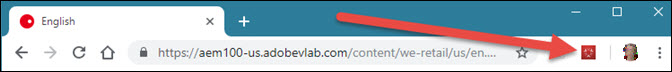

# Install Experience Cloud Debugger{#install-experience-cloud-debugger}

Download and install the Adobe Experience Cloud Debugger extension for Chrome from the [Chrome extension page](https://chrome.google.com/webstore/detail/adobe-experience-cloud-de/ocdmogmohccmeicdhlhhgepeaijenapj).

After you install the extension, an icon is added to the Chrome extension bar:

>[!VIDEO](https://video.tv.adobe.com/v/23114t2/) 
