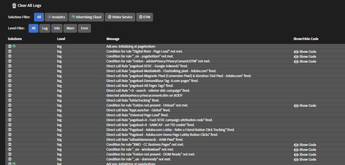

# Logs{#logs}

The Logs screen provides information specific to DTM implementations. The Console Debugging tool for DTM does not need to be enabled to show this information. You can filter by solutions implemented via their associated DTM tools. You can choose which of the following issue severity levels show on the screen:

* Log 
* Info 
* Warnings 
* Errors

Some DTM log items include a Show Code option in their message. Click **[!UICONTROL Show Code]** to view the conditional code that determines whether a rule should fire. 
