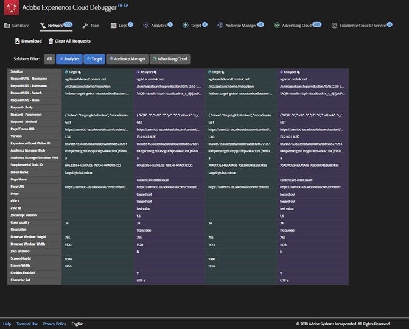
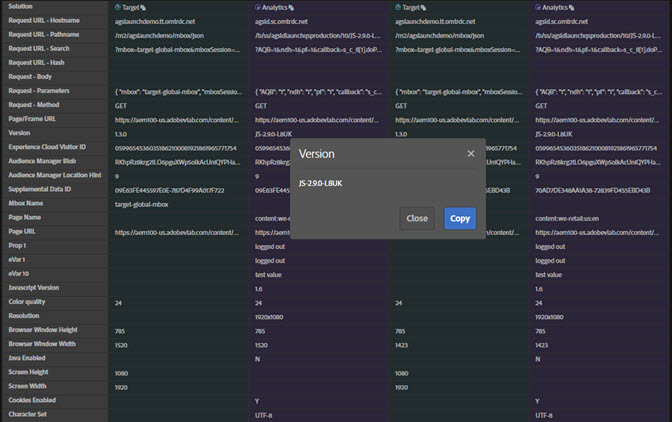
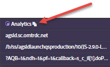

# Network Information{#network-information}

To view Network information, click **[!UICONTROL Network]**.

The Network screen aggregates all of the Adobe Experience Cloud solution calls made on the page and displays them in order from left to right. Standard parameters are automatically labeled with friendly names and arranged to group common parameters on the same role.

>[!TIP]
>
>This screen is useful to confirm that parameters used for integrations, such as the Experience Cloud Visitor ID or the Supplemental Data ID, are consistent across integrations.

>[!NOTE]
>
>At this time, not all parameters passed in the solution calls (for example, Analytics context variables, Target custom parameters, or Experience Cloud ID Service Customer IDs) are visible in the Network screen.

To view all information, select **[!UICONTROL All]**.

You can also filter the information by solution. Select the solutions you want to view. You can view multiple solutions at the same time. The selected solution filters are highlighted.

Click on an item in the Network view to see it larger. From the expanded view window, you can copy the information shown to the Clipboard.

Use the icon at the top of each column to copy the server call URL to your clipboard, where you can paste it into another document for reference or debugging purposes.

