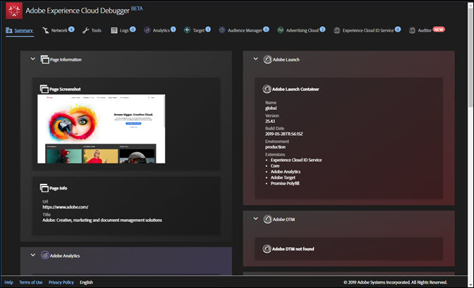
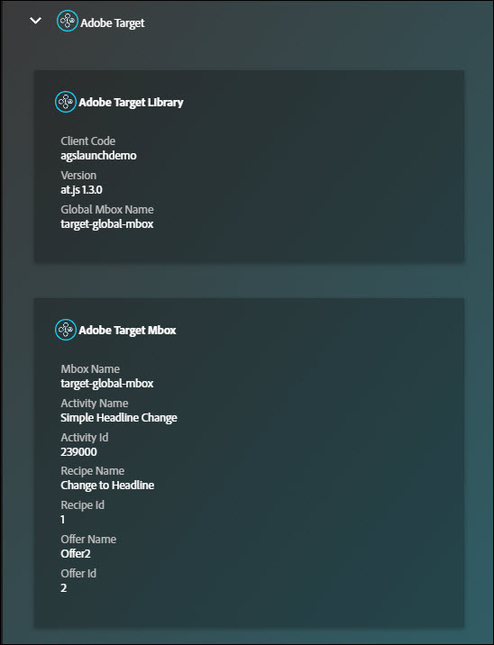

# Summary Screen{#summary-screen}

To run the Experience Cloud Debugger, click the extension icon in the extension bar, then open the page you want to examine in Chrome.

The Adobe Experience Cloud Debugger Summary screen appears.

This screen shows a thumbnail of the page, as well as the URL and title of the page. It also shows information about each Adobe Experience Cloud solution. The information shown varies by solution, but typically includes information including the solution library and version (for example, "AppMeasurement v2.9") and account identifiers (such as the Analytics report suite ID, the Target client code, the Audience Manager partner ID, and so on)

The numbers in blue next to the tabs at the top of the window show the number of server calls that have been made. You can reset these to zero by clicking **[!UICONTROL Clear All Requests]** within the respective tab.

For example, the following image shows information about Adobe Target. Note that to expose the activity details pictured below without authentication, you must implement the Debugging event listener in your code or tag manager and turn on the necessary [response tokens](https://docs.adobe.com/content/help/en/target/using/administer/response-tokens.html) in the Target UI.

## Run an Audit in Auditor {#section-82bc57440406461ebf27a16855b71655}

You can use Adobe Auditor to run a series of audits on your page. To run Auditor, click **[!UICONTROL Auditor]** in the top menu, then click **[!UICONTROL Audit Page Now]**. To open Adobe Auditor, click **[!UICONTROL Run Multi-Page Audit Now]**.

## Information shown in the Debugger {#section-88a95ba53dca43d9b96a585e75e5f5cf}

The Debugger shows the following information for each solution:

**Page Information**

<table id="table_FF3B9083524244D29AF350978A0AC236"> 
 <tbody> 
  <tr> 
   <td colname="col1"> 
Page Screenshot 
 </td> 
   <td colname="col2"> 
Thumbnail of the page 
 </td> 
  </tr> 
  <tr> 
   <td colname="col1"> 
URL 
 </td> 
   <td colname="col2"> 
URL of the page 
 </td> 
  </tr> 
  <tr> 
   <td colname="col1"> 
Title 
 </td> 
   <td colname="col2"> 
The name specified in the  &lt;TITLE&gt; tag 
 </td> 
  </tr> 
 </tbody> 
</table>

**Adobe Analytics**

<table id="table_BEB9CC58E59D4D86BC895A8A51D84A2C"> 
 <tbody> 
  <tr> 
   <td colname="col1"> 
Report Suite(s) 
 </td> 
   <td colname="col2"> 
A <a href="https://experiencecloud.adobe.com/resources/help/en_US/reference/report_suites_admin.html" format="html" scope="external"> report suite</a> defines the complete, independent reporting on a chosen website, set of websites, or subset of web pages 
 </td> 
  </tr> 
  <tr> 
   <td colname="col1"> 
Version 
 </td> 
   <td colname="col2"> 
The <a href="https://experiencecloud.adobe.com/resources/help/en_US/sc/implement/appmeasure_mjs.html" format="html" scope="external"> AppMeasurement</a> version defined for the page 
 </td> 
  </tr> 
  <tr> 
   <td colname="col1"> 
Visitor Version 
 </td> 
   <td colname="col2"> 
The version of the <a href="https://experiencecloud.adobe.com/resources/help/en_US/sc/implement/visid_analytics.html" format="html" scope="external"> visitor ID</a> library. 
 </td> 
  </tr> 
  <tr> 
   <td colname="col1"> 
Page Name 
 </td> 
   <td colname="col2"> 
The <a href="https://experiencecloud.adobe.com/resources/help/en_US/sc/implement/pageName.html" format="html" scope="external"> pageName</a> variable sent to Analytics that contains a user friendly name of the site. 
 </td> 
  </tr> 
  <tr> 
   <td colname="col1"> 
Modules 
 </td> 
   <td colname="col2"> 
The modules loaded by Adobe Analytics 
 </td> 
  </tr> 
 </tbody> 
</table>

**Audience Manager**

<table id="table_784AEABADBDA4D14BB9A7A9CB9EF07C3"> 
 <tbody> 
  <tr> 
   <td colname="col1"> 
Partner 
 </td> 
   <td colname="col2"> 
The <a href="https://experiencecloud.adobe.com/resources/help/en_US/aam/r_dil_get_partner.html" format="html" scope="external"> partner name</a> for the DIL instance 
 </td> 
  </tr> 
  <tr> 
   <td colname="col1"> 
Version 
 </td> 
   <td colname="col2"> 
The<a href="https://experiencecloud.adobe.com/resources/help/en_US/aam/r_api_return_versions_dil.html" format="html" scope="external"> version number</a> for the DIL instance 
 </td> 
  </tr> 
  <tr> 
   <td colname="col1"> 
UUID 
 </td> 
   <td colname="col2"> 
The <a href="https://experiencecloud.adobe.com/resources/help/en_US/aam/ids-in-aam.html" format="html" scope="external"> Unique User ID</a> associated with the DIL instance 
 </td> 
  </tr> 
 </tbody> 
</table>

**Adobe Launch**

<table id="table_E9574975444A407887E26514D1BB1601"> 
 <tbody> 
  <tr> 
   <td colname="col1"> 
Name 
 </td> 
   <td colname="col2"> 
The name of the Adobe Launch <a href="https://docs.adobelaunch.com/administration/companies-and-properties" format="https" scope="external"> property</a> 
 </td> 
  </tr> 
  <tr> 
   <td colname="col1"> 
Version 
 </td> 
   <td colname="col2"> 
The version of <a href="https://developer.adobelaunch.com/guides/extensions/turbine-free-variable/" format="https" scope="external"> Turbine</a> 
 </td> 
  </tr> 
  <tr> 
   <td colname="col1"> 
Build Date 
 </td> 
   <td colname="col2"> 
The Launch <a href="https://docs.adobelaunch.com/publishing/libraries" format="https" scope="external"> library</a> build date 
 </td> 
  </tr> 
  <tr> 
   <td colname="col1"> 
Environment 
 </td> 
   <td colname="col2"> 
The <a href="https://docs.adobelaunch.com/administration/environments" format="https" scope="external"> environment</a> used by the Launch library 
 </td> 
  </tr> 
  <tr> 
   <td colname="col1"> 
Script Directory 
 </td> 
   <td colname="col2"> 
The directory where the Launch script is stored 
 </td> 
  </tr> 
 </tbody> 
</table>

**Adobe DTM**

<table id="table_DC76D63FA6EF4891906B9E1D3E4A8A6C"> 
 <tbody> 
  <tr> 
   <td colname="col1"> 
Library Name 
 </td> 
   <td colname="col2"> 
The name of the Adobe DTM<a href="https://experiencecloud.adobe.com/resources/help/en_US/dtm/library_management.html" format="html" scope="external"> library</a> 
 </td> 
  </tr> 
  <tr> 
   <td colname="col1"> 
Version 
 </td> 
   <td colname="col2"> 
The version of Turbine 
 </td> 
  </tr> 
  <tr> 
   <td colname="col1"> 
Build Date 
 </td> 
   <td colname="col2"> 
The Launch <a href="https://experiencecloud.adobe.com/resources/help/en_US/dtm/library_management.html" format="html" scope="external"> library</a> build date 
 </td> 
  </tr> 
  <tr> 
   <td colname="col1"> 
Environment 
 </td> 
   <td colname="col2"> 
The environment used by the DTM library 
 </td> 
  </tr> 
  <tr> 
   <td colname="col1"> 
Script Directory 
 </td> 
   <td colname="col2"> 
The directory where the DTM script is stored 
 </td> 
  </tr> 
 </tbody> 
</table>

**Adobe Experience Cloud ID Service**

<table id="table_274CFCEFA8F34D16BB546B4669EC0209"> 
 <tbody> 
  <tr> 
   <td colname="col1"> 
Experience Cloud Org ID 
 </td> 
   <td colname="col2"> 
Your <a href="https://experiencecloud.adobe.com/resources/help/en_US/mcvid/" format="https" scope="external"> Organization ID</a> 
 </td> 
  </tr> 
  <tr> 
   <td colname="col1"> 
Version 
 </td> 
   <td colname="col2"> 
The version of the<a href="https://experiencecloud.adobe.com/resources/help/en_US/sc/implement/visid_analytics.html" format="html" scope="external"> visitor ID</a> library 
 </td> 
  </tr> 
 </tbody> 
</table>

**Adobe Target**

<table id="table_D30E0CD20FB04E41862B22655136E043"> 
 <tbody> 
  <tr> 
   <td colname="col1"> 
Client Code 
 </td> 
   <td colname="col2"> 
Your Target <a href="https://docs.adobe.com/content/help/en/target/using/implement-target/client-side/deploy-at-js/implementing-target-without-a-tag-manager.html" format="html" scope="external"> Client Code </a> 
 </td> 
  </tr> 
  <tr> 
   <td colname="col1"> 
Version 
 </td> 
   <td colname="col2"> 
Your current <a href="https://docs.adobe.com/content/help/en/target/using/implement-target/client-side/target-atjs-versions.html" format="html" scope="external"> at.js</a> or mbox.js version 
 </td> 
  </tr> 
  <tr> 
   <td colname="col1"> 
Global Mbox Name 
 </td> 
   <td colname="col2"> 
The<a href="https://docs.adobe.com/help/en/target/using/implement-target/client-side/mbox-implement/global-mbox/understanding-global-mbox.html" format="html" scope="external"> global mbox</a> refers to the single server call made at the top of each web page in your Target implementation 
 </td> 
  </tr> 
  <tr> 
   <td colname="col1"> 
Mbox Name 
 </td> 
   <td colname="col2"> 
The name of an mbox around a <a href="https://docs.adobe.com/content/help/en/target/using/implement-target/client-side/mbox-implement/global-mbox/understanding-global-mbox.html" format="html" scope="external"> location</a> on the page. Available without authentication only if you implement the Debugging event listener in your code or tag manager and turn on the necessary <a href="https://docs.adobe.com/content/help/en/target/using/administer/response-tokens.html" format="html" scope="external"> response tokens</a> in the Target UI. 
 </td> 
  </tr> 
  <tr> 
   <td colname="col1"> 
Activity Name 
 </td> 
   <td colname="col2"> 
The name of the Target <a href="https://docs.adobe.com/content/help/en/target/using/activities/activities.html" format="html" scope="external"> campaign or activity</a>. Available without authentication only if you implement the Debugging event listener in your code or tag manager and turn on the necessary <a href="https://docs.adobe.com/content/help/en/target/using/administer/response-tokens.html" format="html" scope="external"> response tokens</a> in the Target UI. 
 </td> 
  </tr> 
  <tr> 
   <td colname="col1"> 
Activity ID 
 </td> 
   <td colname="col2"> 
The ID of the Target activity. Available without authentication only if you implement the Debugging event listener in your code or tag manager and turn on the necessary <a href="https://docs.adobe.com/content/help/en/target/using/administer/response-tokens.html" format="html" scope="external"> response tokens</a> in the Target UI. 
 </td> 
  </tr> 
  <tr> 
   <td colname="col1"> 
Recipe Name 
 </td> 
   <td colname="col2"> 
The name of the Target <a href="https://docs.adobe.com/content/help/en/target/using/experiences/experiences.html" format="html" scope="external"> experience</a>. Available without authentication only if you implement the Debugging event listener in your code or tag manager and turn on the necessary <a href="https://docs.adobe.com/content/help/en/target/using/administer/response-tokens.html" format="html" scope="external"> response tokens</a> in the Target UI. 
 </td> 
  </tr> 
  <tr> 
   <td colname="col1"> 
Recipe ID 
 </td> 
   <td colname="col2"> 
The ID of the Target recipe. Available without authentication only if you implement the Debugging event listener in your code or tag manager and turn on the necessary <a href="https://docs.adobe.com/content/help/en/target/using/administer/response-tokens.html" format="html" scope="external"> response tokens</a> in the Target UI. 
 </td> 
  </tr> 
  <tr> 
   <td colname="col1"> 
Offer 
 </td> 
   <td colname="col2"> 
The name of the Target <a href="https://docs.adobe.com/content/help/en/target/using/experiences/offers/manage-content.html" format="html" scope="external"> offer</a>. Available without authentication only if you implement the Debugging event listener in your code or tag manager and turn on the necessary <a href="https://docs.adobe.com/content/help/en/target/using/administer/response-tokens.html" format="html" scope="external"> response tokens</a> in the Target UI. 
 </td> 
  </tr> 
  <tr> 
   <td colname="col1"> 
Offer ID 
 </td> 
   <td colname="col2"> 
The ID of the Target offer. Available without authentication only if you implement the Debugging event listener in your code or tag manager and turn on the necessary <a href="https://docs.adobe.com/content/help/en/target/using/administer/response-tokens.html" format="html" scope="external"> response tokens</a> in the Target UI. 
 </td> 
  </tr> 
 </tbody> 
</table>

