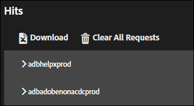
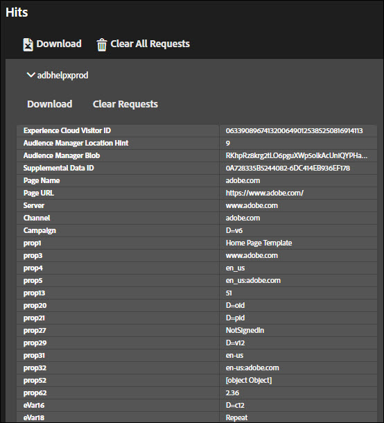
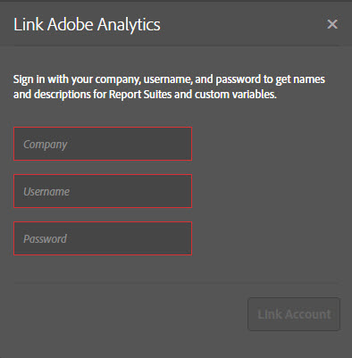
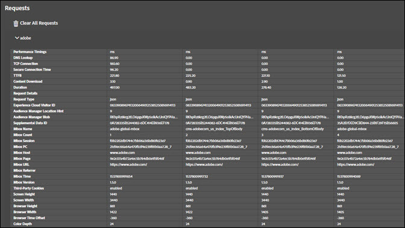
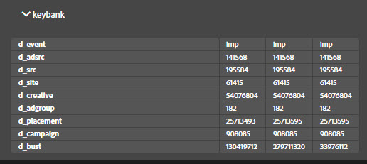
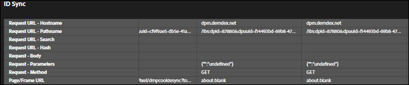

# Solution Tabs{#solution-tabs}

Click the solution tabs to see the results for specific Adobe Experience Cloud solutions.

## Analytics {#section-f71dfcc22bb44c86bec328491606a482}

The Analytics tab provides information about your [Analytics](https://experiencecloud.adobe.com/resources/help/en_US/reference/) implementation.

**Hits**

By default, all server calls made to the same report suite are collapsed.

**Download:** Download information about all displayed report suites as an Excel spreadsheet.

**Clear All Requests:** Remove all displayed requests from the Analytics view. After you clear the requests, new requests will display when they occur.

Click the report suite ID to expand the view:

This screen displays all requests since the Debugger was opened or the requests were cleared. Default parameters are mapped to friendly names automatically. [Prop and eVar](https://experiencecloud.adobe.com/resources/help/en_US/sc/implement/props_eVars.html) variables can be mapped to your custom friendly names (for example, "prop1" could display as "User Type") if you authenticate using the "Link Analytics" feature (see below). Requests are displayed in sequence from left to right.

**Download:** Save all requests made to the report suite as an Excel spreadsheet.

**Clear Requests:** Remove all requests made to this report suite. New requests appear as they occur.

**Linked Accounts (Legacy)**

Click **[!UICONTROL Link Account]**, then enter the requested information to link an Analytics account to the Debugger.

>[!NOTE]
>
>Currently, this feature is only supported for legacy Analytics user login credentials.

**Retrieve Post-Processed Hits**

Enable the Retrieve Post-Processed Hits option if you want to see the values on Analytics hits after processing rules have run. You must be signed in to Adobe Experience Cloud for this feature to function.

When this option is enabled, a debugging parameter is added to your Analytics requests. Hits continue to be processed like any other hits. Debugger polls the Analytics debugging API to retrieve post-processing rules values for any hits that have an original Hit ID. Post-processed hits have a purple background and are shown next to the original hit.

For most Analytics implementations, the post-processing rules info is available within a few minutes. Analytics for Target (A4T) implementation take significantly longer.

## Target {#section-988873ba5ede4317953193bd7ac5474c}

Use the Target tab to view [Target](https://docs.adobe.com/content/help/en/target/using/target-home.html) requests or [Mbox Trace](https://docs.adobe.com/content/help/en/target/using/activities/troubleshoot-activities/content-trouble.html) response details.

Click **[!UICONTROL Requests]**, then expand the environment to view information about Target.

Click **[!UICONTROL Clear All Requests]** to remove the currently displayed requests. More requests will appear as they are made.

You can also use the Target filter to [enable MBox Trace for Target debugging purposes](https://docs.adobe.com/content/help/en/target/using/activities/troubleshoot-activities/content-trouble.html).

You must have an open Chrome tab that is authenticated into the Experience Cloud to enable Mbox Trace. Once enabled, it shows your Adobe Id user name. Expand your user name to expose the Target client codes associated with the Experience Cloud organizations to which you have access. Click on the client code for which you want to enable Mbox Trace and confirm that the green check mark appears. All Target requests with Mbox Trace information will now appear, grouped by client code. To explore the Mbox Trace information, expand the request to see the tabs:

* [Activities](https://docs.adobe.com/content/help/en/target/using/activities/activities.html)  The Activities tab shows all of the activities associated with the Target request name, regardless of whether you qualified for the activity. "Matched Activities" are the activities for which you qualified and whose offers were delivered in the response. You can expand the activity name to confirm the experience you are in and which audiences and targeting conditions qualified you for the activity. "Evaluated Activities" are all of the activities evaluated, regardless of whether you qualified. To troubleshoot why you are not qualifying for an activity that was "Evaluated" but not "Matched," expand the activity name and review the "Unmatched Audiences" section. 

* Request

  The request tab of [Mbox Trace](https://docs.adobe.com/content/help/en/target/using/activities/troubleshoot-activities/content-trouble.html) is similar to the main request tab. You can view all of the parameters passed by the Target request, in addition to the request headers. 
* Profile

  Expand the Profile Snapshot section to see [profile information](https://docs.adobe.com/content/help/en/target/using/audiences/visitor-profiles/variables-profiles-parameters-methods.html) stored about you as a visitor in the Target profile database. All in-mbox and script profiles are exposed here, as well as some system profiles. The Status column shows which profiles changed within the scope of this request, as well as their values before and after the request entered the profile system. 
* Audience Manager

  The "segmentIds" and "cachedSegmentIds" sections of the Audience Manager tab expose the IDs of [audiences](https://docs.adobe.com/content/help/en/target/using/audiences/target.html) shared from the Experience Cloud to Target, and for which you have qualified. These could be audiences created in Audience Manager, Analytics, or the Audience builder in the People Core Service. These IDs can be looked up in the Audience Manager user interface to find the audience name.

The following video shows the general Target functionality:

>[!VIDEO](https://video.tv.adobe.com/v/23115t2/)

The following video shows Mbox Trace:

>[!VIDEO](https://video.tv.adobe.com/v/23113t2/)

## Audience Manager {#section-1d4484f8b46f457f859ba88039a9a585}

Use the [Audience Manager](https://experiencecloud.adobe.com/resources/help/en_US/aam/) tab to view details of [events](https://experiencecloud.adobe.com/resources/help/en_US/aam/dcs-event-calls.html). Click the organization to expand it and show the information.

Click **[!UICONTROL Clear All Events]** to reset the displayed information. New events will appear as they occur.

**ID Sync**

ID synchronization is the first step in the inbound, asynchronous data transfer process. In this step, Audience Manager and the vendor compare and match IDs for their respective site visitors.

See [ID Synchronization for Inbound Data Transfers](https://experiencecloud.adobe.com/resources/help/en_US/aam/c_id_sync_in.html) in the Audience Manager Product Documentation for more information.

## Advertising Cloud {#section-ee80a9c509f2462c89c1e5bd8d05d7c8}

Use the Advertising Cloud tab to view Advertising Cloud requests.

Click **[!UICONTROL Requests]**, then expand the environment to view information about Advertising Cloud.

Click **[!UICONTROL Clear All Requests]** to remove the currently displayed requests. More requests will appear as they are made.

## Experience Cloud ID Service {#section-a96c32f8e63a4991abb296f6e8ea01cf}

Use the Experience Cloud ID Service tab to view [Experience Cloud ID Service](https://experiencecloud.adobe.com/resources/help/en_US/mcvid/) requests.

Click **[!UICONTROL Requests]**, then expand the environment to view information about Experience Cloud ID Service.

Click **[!UICONTROL Clear All Requests]** to remove the currently displayed requests. More requests will appear as they are made. 
