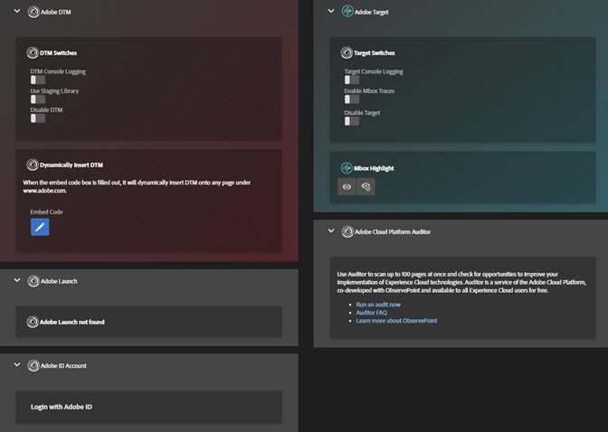
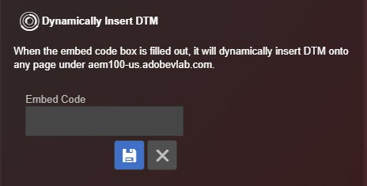

# Tools{#tools}

On the Tools screen, you can enable or disable various tools for the installed solution. For example, you can turn on Target's console debugging statements or use the DTM Staging Library. These tools are only available if Target and DTM are installed on your page.

You can dynamically insert Launch or DTM on any page to test something on a page that does not have Launch or DTM installed. Click the **[!UICONTROL Embed Code]** icon, then type your [embed code](https://experiencecloud.adobe.com/resources/help/en_US/dtm/deployment.html) and click **[!UICONTROL Save]**.

## DTM Information {#section-c3d43040440449e5a050170843a600b7}

<table id="table_04625C3319134E169A35DB74C1D1FB31"> 
 <thead> 
  <tr> 
   <th colname="col1" class="entry"> Tool </th> 
   <th colname="col2" class="entry"> Description </th> 
  </tr>
 </thead>
 <tbody> 
  <tr> 
   <td colname="col1"> 
 DTM Console Logging 
 </td> 
   <td colname="col2"> 
This tool exposes DTM-specific debugging statements to the browser console. 
 </td> 
  </tr> 
  <tr> 
   <td colname="col1"> 
Use Staging Library 
 </td> 
   <td colname="col2"> 
This tool uses the Staging library for DTM debugging information. 
 </td> 
  </tr> 
  <tr> 
   <td colname="col1"> 
Disable DTM 
 </td> 
   <td colname="col2"> 
This tool blocks DTM information from being checked. 
 </td> 
  </tr> 
  <tr> 
   <td colname="col1"> 
 Dynamically Insert DTM 
 </td> 
   <td colname="col2"> 
 This tool inserts DTM code on your page. Use the Embed Code editor to edit the code that is inserted. 
 </td> 
  </tr> 
 </tbody> 
</table>

## Target Information {#section-31090d95f50e455692b672c26e6a2051}

<table id="table_A71D269B49F4417599EBACA44D5CCF4F"> 
 <thead> 
  <tr> 
   <th colname="col1" class="entry"> Tool </th> 
   <th colname="col2" class="entry"> Description </th> 
  </tr>
 </thead>
 <tbody> 
  <tr> 
   <td colname="col1"> 
Target Console Logging 
 </td> 
   <td colname="col2"> 
This tool exposes Target-specific debugging statements to the browser console, all beginning with the  AT: prefix, by adding a cookie called  mboxDebug=true to your browser. At this time, the console statements do not appear within the Debugger Logs screen, but are visible in the browser's native debugging console. 
 
 This tool requires at.js 0.9.6+. If you are using an older version of at.js, you can add the  ?mboxDebug=true query string parameter to your URL in order to turn on console logging. If you are using mbox.js, you can add the  ?_AT_Debug=console parameter to turn on console logging limited to Visual Experience Composer activities. 
 </td> 
  </tr> 
  <tr> 
   <td colname="col1"> 
 Enable Mbox Traces 
 </td> 
   <td colname="col2"> 
This tool adds detailed information to Target responses, which can be explored in the  Target&gt;Mbox Trace screen of the debugger. 
 
 You must have be logged into the Experience Cloud in one of your Chrome tabs to enable this tool. 
 </td> 
  </tr> 
  <tr> 
   <td colname="col1"> 
Disable Target 
 </td> 
   <td colname="col2"> 
This tool disables all Target requests by adding a cookie called  mboxDisable=true to your browser. 
 
 This tool requires at.js 0.9.6+. If you are using an older version, you can add the  ?mboxDisable=true query string parameter to your URL to disable mboxes. 
 </td> 
  </tr> 
  <tr> 
   <td colname="col1"> 
 Mbox Highlight 
 </td> 
   <td colname="col2"> 
 This tool draws a red box around legacy, wrapping-style mboxes. 
 </td> 
  </tr> 
 </tbody> 
</table>

The following video explains how to use the Debugger extension with Adobe Target.

>[!VIDEO](https://video.tv.adobe.com/v/23115t2/) 
